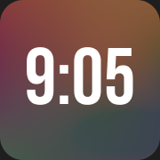
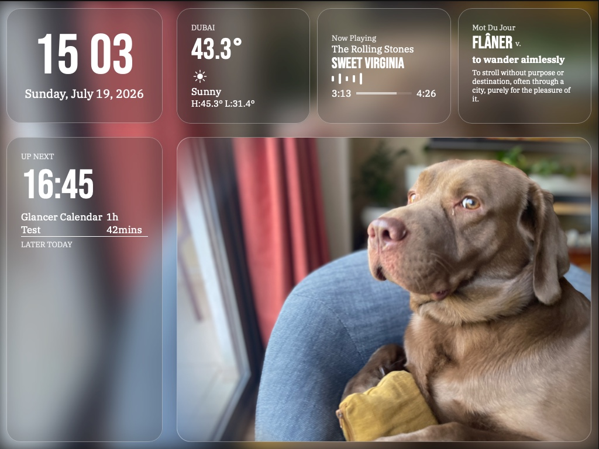

<p align="center">
  
</p>

# Glancer

A TRMNL-inspired ambient dashboard for an old iPad Mini 2, showing the time, calendar, weather, now playing, and a photo, all at a glance.



## What it is

Glancer turns a retired iPad Mini 2 (the A1489, if you're wondering) into an always-on desk display. It sits on wired power, no scrolling, no interaction, just information you can read at a glance. A Mac on the same network runs a small Flask server that feeds it live data, but the Mac is optional. Kill it and the dashboard keeps showing whatever it last knew.

## Try it

**[vismaysjayaram.github.io/glancer-desktop-view](https://vismaysjayaram.github.io/glancer-desktop-view/)**

This is a static build, so it's the look and layout without the live data, the real thing only comes alive when it's talking to a Mac on the same network.

## Quick start

To run the real thing, with live data, on your own machine:

1. Clone this repo.
2. `pip3 install flask flask-cors caldav icalendar recurring-ical-events python-dotenv`
3. Create a `.env` file in the project root:
   ```
   ICLOUD_USERNAME=your_apple_id@icloud.com
   ICLOUD_PASSWORD=your_app_specific_password
   ```
   The password has to be an app-specific one, generated at appleid.apple.com, not your actual iCloud password. `calendar_service.py` reads both values via `python-dotenv`, and the `.env` file is gitignored so it never gets committed.
4. `python3 python_server.py`
5. Visit `http://localhost:8080/glancer` in a browser. ( Or your computer ip instead of localhost)

On the actual iPad, open the same address in Safari and "Add to Home Screen" so it launches fullscreen with no address bar.

## Features

- Live clock with a blinking colon, because a static clock looked dead..
- Calendar pulled from iCloud (CalDAV), with recurring events expanded and a "next up" + "later today" layout,
- Weather from Open-Meteo, current temp plus high/low, no API key needed,
- Now playing, read straight from Music.app on the Mac via AppleScript,
- Photo panel that cycles through your own photos,
- French word of the day, from a large list since i was too lazy to do yet another API

## Running it locally

You need:

- Python 3 with the packages listed above
- A Mac, since now playing depends on AppleScript talking to Music.app (NO SPOTIFY)
- An iCloud calendar and an app-specific password for it

For actual always-on use, the server should run persistently via `launchd` rather than a terminal window you have to keep open. Create a p-list in that case, and just fill in the boilerplate according to your OS. 

## How it works

The whole frontend is handwritten HTML/CSS/JS, no frameworks, no build tools. In an age where most software gets scaffolded, generated, or assembled from someone else's components, this one is simple, handwritten, and built, maintained, and used by exactly one person.

It's very simple at its heart. It's just simple HTML to form a rough grid made of layered divs, Css to style it into position, animating the equalizer, as well as to induce the "glass" effect. It's Constrained to 1024 by 768 px, specifically for an iPad mini. I have no intentions of expanding this project, so a hardcoded size was best. 

Javascript at the back updates the clock, fills in the calendar, pulls and fetchs weather data, updates song info, fills in photo and background card from the mac, and automatically fills in the definitions. List was created by a machine sadly. 

On the mac side, we've got some Python running a couple services, including a few to get the Music app's info, including song, artist, and player state. In addition, a couple links to host Glancer, draw files, and update the calendar. 

The calendar service is also pretty simple. It connects to iCloud over CalDAV using your app-specific password, pulls every event from every calendar, and merges them into one. Since iCloud doesn't expand recurring events on its own, recurring_ical_events turns "every Monday" into actual dated instances. Everything's then filtered down to just today and sorted by start time.

To get the music, we just have a bit of applescript to draw player states, nothing special. 

Use at your own peril. This project is liable to break at anytime. :)

## AI Usage
A little ai was used to learn about python and applescript, because most tutorials I found were from 2013. AI was also used for calendar_service.py, because CalDav was not playing nice with me. AI was finally used to create mots.js, simply because i had no clue if there was a nicely formatted list of french words on the internet that wasn't overwhelming to use. 

## Credits

- Layout and ambient style inspired by [TRMNL](https://usetrmnl.com)
- Weather data from [Open-Meteo](https://open-meteo.com)
- Fonts: Bebas Neue (self-hosted) and IBM Plex Serif (Google Fonts)
- Css glass effect heavily inspired by this site : [Glass Effect Generator](https://wpdean.com/t/css-glassmorphism-generator/)